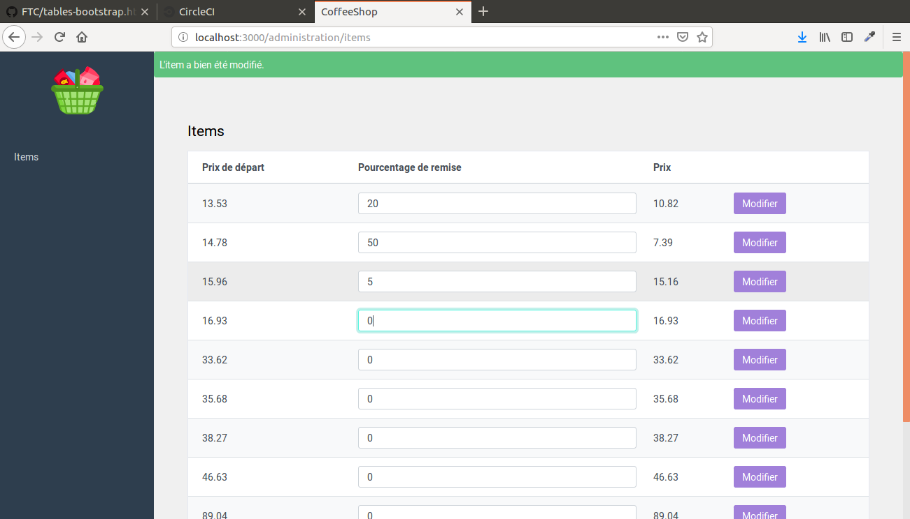

   In this section, we will try to write lean controllers that hold close to no logic.

   We want to write a simple update method in the items controller that will allow us to update the discount_percentage of each item in our index table.  

   Obviously, updating the discount_percentage will modify the price.

   Here's what your view should look like once the controller is complete : 

