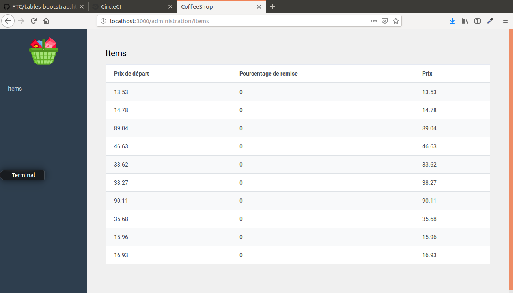

We will not tackle design issues during this course and overall, we will not focus on front-end development.

Nevertheless :
   * it is important to have a basic understanding of UX conventions in order to deliver practical functionalities
   * it is important to know how to articulate views in your projects and how to structure them in a conventional rails way

In this section, we will write the view corresponding to the index of the items resource in the administration namespace.
Run the command `rails db:seed`.
You will notice that the table is empty for now. 
Make sure that it fills with the information from the database. Don't hesitate to use a partial.

Here's what your view should look like once it's complete : 

